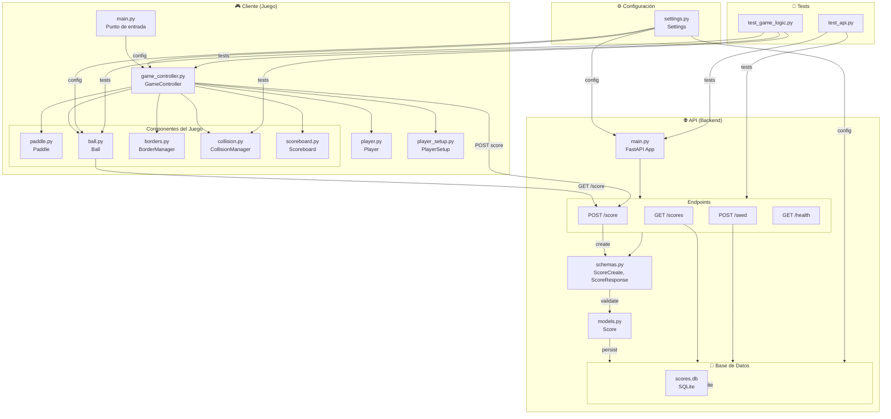
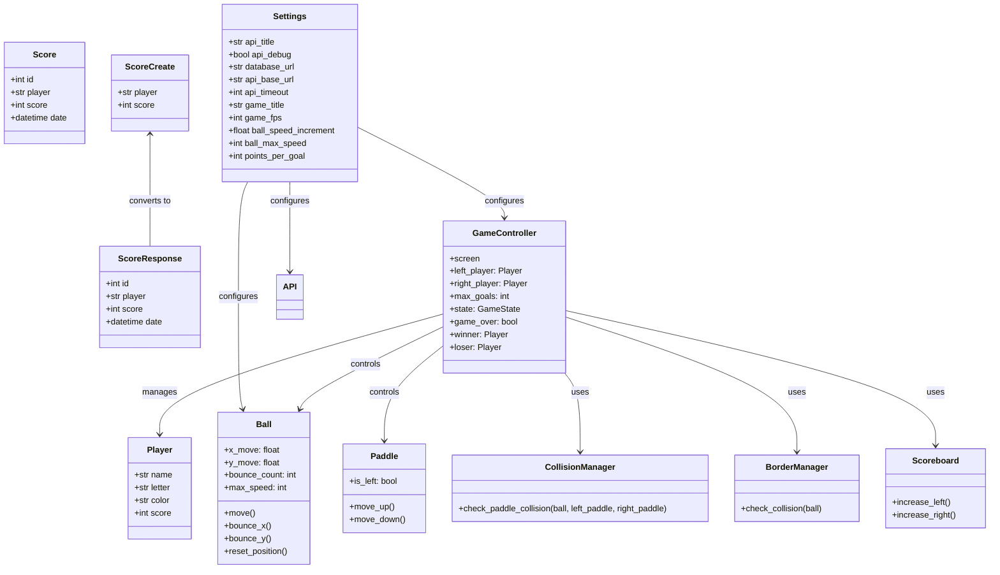
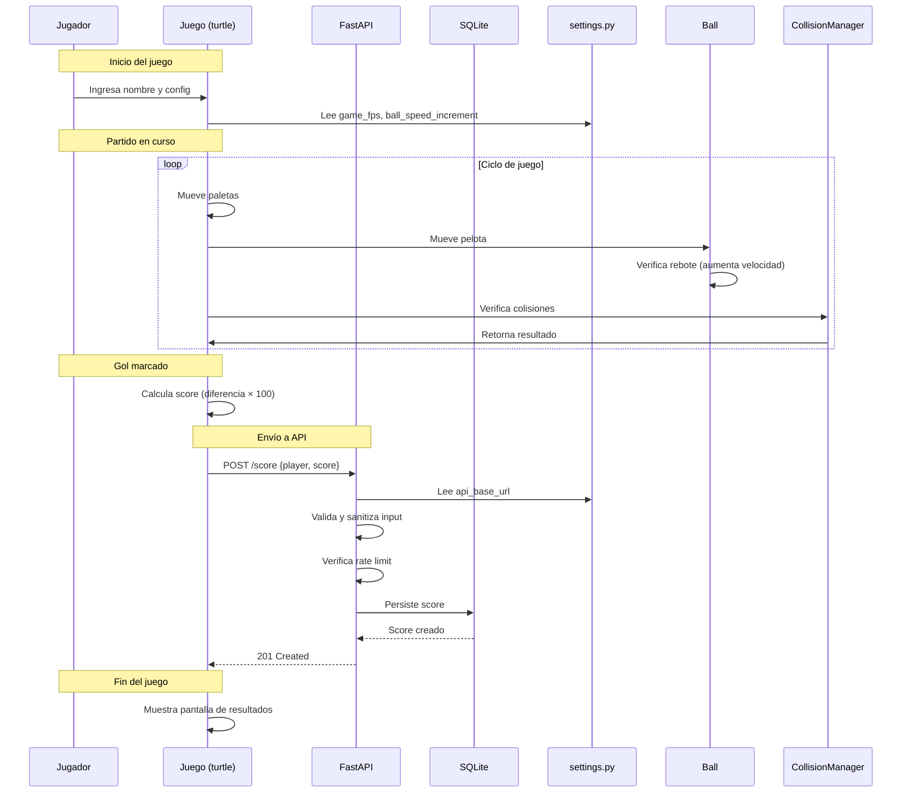

```mermaid
flowchart TB
    subgraph Client["🎮 Cliente (Juego)"]
        direction TB
        Main["main.py<br/>Punto de entrada"]
        GC["game_controller.py<br/>GameController"]
        Player["player.py<br/>Player"]
        
        subgraph GameComponents["Componentes del Juego"]
            Paddle["paddle.py<br/>Paddle"]
            Ball["ball.py<br/>Ball"]
            Border["borders.py<br/>BorderManager"]
            Collision["collision.py<br/>CollisionManager"]
            Scoreboard["scoreboard.py<br/>Scoreboard"]
        end
        
        PlayerSetup["player_setup.py<br/>PlayerSetup"]
    end
    
    subgraph API["🌐 API (Backend)"]
        direction TB
        MainAPI["main.py<br/>FastAPI App"]
        
        subgraph Endpoints["Endpoints"]
            Score["POST /score"]
            Scores["GET /scores"]
            Seed["POST /seed"]
            Health["GET /health"]
        end
        
        Schemas["schemas.py<br/>ScoreCreate, ScoreResponse"]
        Models["models.py<br/>Score"]
        Database["database.py<br/>SQLAlchemy"]
    end
    
    subgraph Database["💾 Base de Datos"]
        SQLite["scores.db<br/>SQLite"]
    end
    
    subgraph Settings["⚙️ Configuración"]
        SettingsFile["settings.py<br/>Settings"]
    end
    
    subgraph Tests["🧪 Tests"]
        TestAPI["test_api.py"]
        TestGame["test_game_logic.py"]
    end
    
    %% Relaciones
    Main --> GC
    GC --> Player
    GC --> Paddle
    GC --> Ball
    GC --> Border
    GC --> Collision
    GC --> Scoreboard
    GC --> PlayerSetup
    
    Ball -->|GET /score| Score
    Score -->|create| Schemas
    Schemas -->|validate| Models
    Models -->|persist| Database
    Database -->|write| SQLite
    
    GC -->|POST score| Score
    
    MainAPI --> Endpoints
    Endpoints --> Schemas
    Scores --> Database
    Seed --> Database
    
    SettingsFile -->|config| MainAPI
    SettingsFile -->|config| Database
    SettingsFile -->|config| GC
    SettingsFile -->|config| Ball
    
    TestAPI -->|tests| MainAPI
    TestAPI -->|tests| Endpoints
    TestGame -->|tests| GC
    TestGame -->|tests| Collision
    TestGame -->|tests| Ball
```

---

## Diagrama de Arquitectura

```mermaid
classDiagram
    class Score {
        +int id
        +str player
        +int score
        +datetime date
    }
    
    class ScoreCreate {
        +str player
        +int score
    }
    
    class ScoreResponse {
        +int id
        +str player
        +int score
        +datetime date
    }
    
    class Settings {
        +str api_title
        +bool api_debug
        +str database_url
        +str api_base_url
        +int api_timeout
        +str game_title
        +int game_fps
        +float ball_speed_increment
        +int ball_max_speed
        +int points_per_goal
    }
    
    class GameController {
        +screen
        +left_player: Player
        +right_player: Player
        +max_goals: int
        +state: GameState
        +game_over: bool
        +winner: Player
        +loser: Player
    }
    
    class Player {
        +str name
        +str letter
        +str color
        +int score
    }
    
    class Ball {
        +x_move: float
        +y_move: float
        +bounce_count: int
        +max_speed: int
        +move()
        +bounce_x()
        +bounce_y()
        +reset_position()
    }
    
    class Paddle {
        +is_left: bool
        +move_up()
        +move_down()
    }
    
    class CollisionManager {
        +check_paddle_collision(ball, left_paddle, right_paddle)
    }
    
    class BorderManager {
        +check_collision(ball)
    }
    
    class Scoreboard {
        +increase_left()
        +increase_right()
    }
    
    ScoreCreate <-- ScoreResponse : converts to
    Settings --> GameController : configures
    Settings --> Ball : configures
    Settings --> API : configures
    GameController --> Player : manages
    GameController --> Ball : controls
    GameController --> Paddle : controls
    GameController --> CollisionManager : uses
    GameController --> BorderManager : uses
    GameController --> Scoreboard : uses
```

---

## Flujo de Datos

```mermaid
sequenceDiagram
    participant User as Jugador
    participant Game as Juego (turtle)
    participant API as FastAPI
    participant DB as SQLite
    participant Settings as settings.py
    
    Note over User,Game: Inicio del juego
    User->>Game: Ingresa nombre y config
    Game->>Settings: Lee game_fps, ball_speed_increment
    
    Note over User,Game: Partido en curso
    loop Ciclo de juego
        Game->>Game: Mueve paletas
        Game->>Ball: Mueve pelota
        Ball->>Ball: Verifica rebote (aumenta velocidad)
        Game->>CollisionManager: Verifica colisiones
        CollisionManager->>Game: Retorna resultado
    end
    
    Note over User,Game: Gol marcado
    Game->>Game: Calcula score (diferencia × 100)
    
    Note over Game,API: Envío a API
    Game->>API: POST /score {player, score}
    API->>Settings: Lee api_base_url
    API->>API: Valida y sanitiza input
    API->>API: Verifica rate limit
    API->>DB: Persiste score
    DB-->>API: Score creado
    API-->>Game: 201 Created
    
    Note over User,Game: Fin del juego
    Game->>Game: Muestra pantalla de resultados
```
